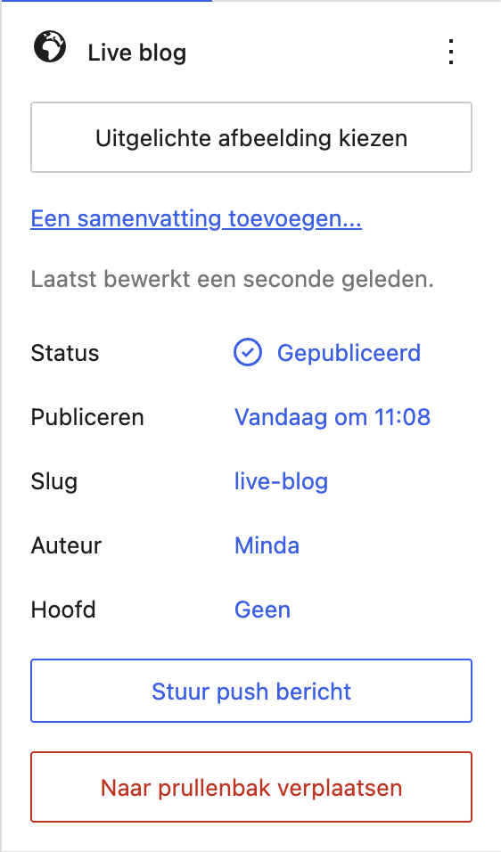

# wp-live-content

[](https://github.com/yardinternet/wp-live-content/actions/workflows/format-php.yml)
[](https://github.com/yardinternet/wp-live-content/actions/workflows/phpstan.yml)
[](https://github.com/yardinternet/wp-live-content/actions/workflows/run-tests.yml)
[](https://github.com/yardinternet/wp-live-content/actions/workflows/badges.yml)
[](https://github.com/yardinternet/wp-live-content/actions/workflows/badges.yml)


## Requirements

- [WordPress](https://wordpress.org) >= 6.6
- [Sage](https://github.com/roots/sage) >= 10.0
- [Acorn](https://github.com/roots/acorn) >= 4.0

## Installation

To install this package using Composer, follow these steps:

1. Add the following to the `repositories` section of your `composer.json`:

    ```json
    {
      "type": "vcs",
      "url": "git@github.com:yardinternet/wp-live-content.git"
    }
    ```

2. Install this package with Composer:

    ```sh
    composer require yard/wp-live-content
    ```

3. Run the Acorn WP-CLI command to discover this package:

    ```shell
    wp acorn package:discover
    ```

## Configuration

Live content is opt-in per post type, so publish the config file to declare which post types it applies to:

```shell
wp acorn vendor:publish --provider="Yard\LiveContent\LiveContentServiceProvider"
```

This writes `config/wp-live-content.php` to your theme. List the post types there:

```php
return [
    'post-types' => [
        'openpub-item',
    ],
];
```

The post types you list here decide where the **Stuur push bericht** button shows up in the block editor. Without this file the package falls back to its own default, which only covers `openpub-item`.

## Usage

From a Blade template:

```blade
<x-yard-live-content post-id="{{ $postId }}" />
```

Editors send a push notification with the **Stuur push bericht** button under **Status & visibility** in the block editor.



## About us

[](https://www.yard.nl/werken-bij/)
